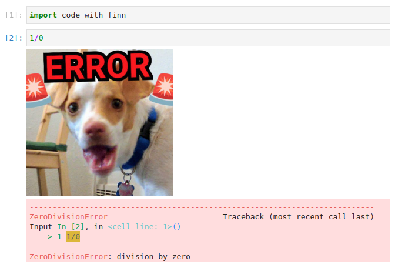
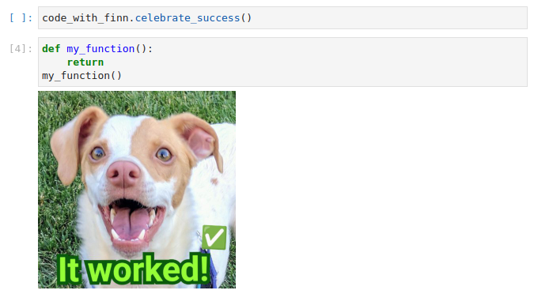
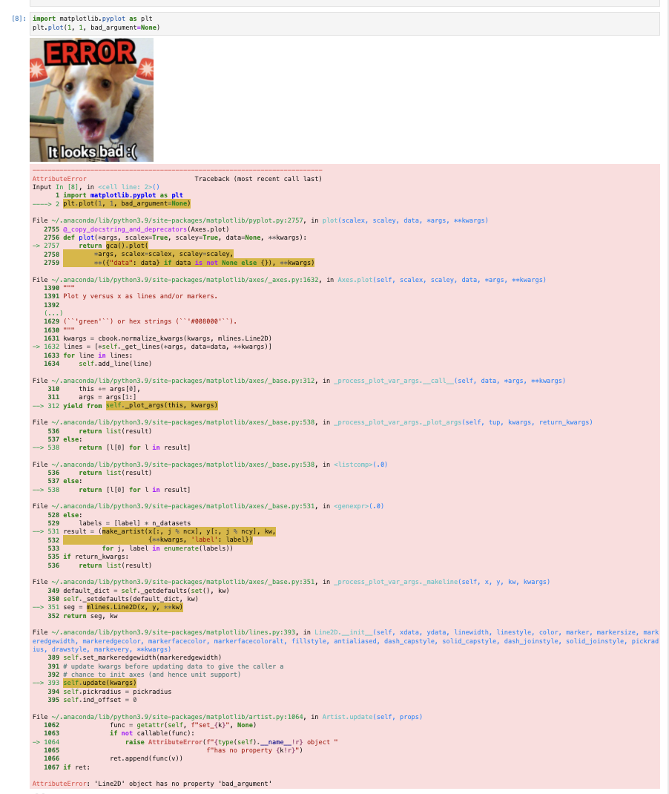
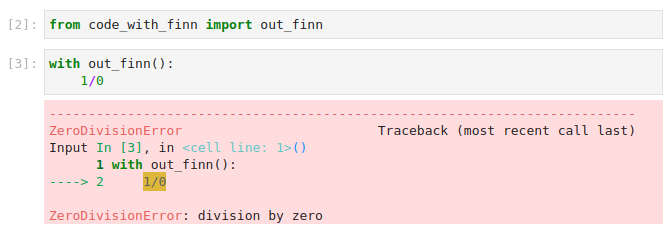

# code_with_finn

A small module that brings the good dog Finn into your Jupyter notebooks.

While Finn can cheer you up after errors, he can also celebrate successes!

He can also help you prepare yourself before a long stack trace.

You can send him away if you need to:

